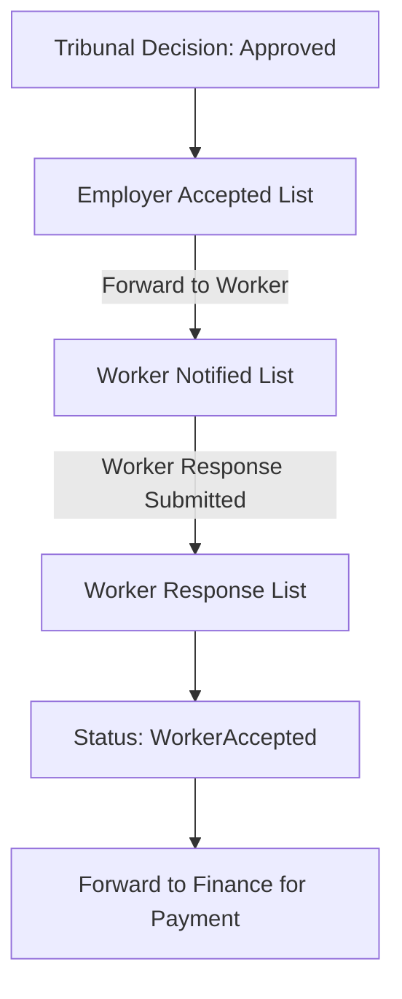

# CPPS 2026: Tribunal Operational Manual

This manual provides a detailed technical and operational walkthrough of the **Tribunal Module** within the CPPS 2026 system. It is designed for Tribunal Clerks, Officers, and System Administrators.

---

## 1. Module Overview
The Tribunal Module is the adjudicative core of the CPPS 2026 system. It manages the transition from administrative claim processing to formal legal hearings and eventual worker notification.

### Core Objectives
- Efficient scheduling of both Public and Private sector hearings.
- Precise recording of legal outcomes and decisions.
- Management of the Form 18 "Notification to Worker" pipeline.

---

## 2. Hearing Lifecycle Workflow

The lifecycle of a tribunal case follows four distinct phases:

### Phase A: Pending Review
Claims arrive at the Tribunal after preliminary OWC review. They appear in the **Hearing Pending** list.
- **Criteria**: Status is `HearingPending` in `tribunalhearingschedule`.
- **Action**: Clerk reviews the claim details and assigns a hearing date.

### Phase B: Scheduling
Once a date is selected, the record moves to the **Scheduled Hearings** registry.
- **Criteria**: Status is `Pending` in `tribunalhearingsethearing`.
- **Action**: Formal notification is generated for all parties (Claimant, Employer, and Solicitor General).

### Phase C: Hearing Completion & Outcomes
After the hearing takes place, the outcome must be formally recorded. The system supports four primary decision types:

| Outcome | Description | Post-Action |
| :--- | :--- | :--- |
| **Approved** | The claim is validated and award is granted. | Enters Form 18 Pipeline. |
| **Consented** | Parties reached a mutual agreement. | Enters Form 18 Pipeline. |
| **Adjourned** | Hearing postponed for more evidence. | Returns to Scheduled list. |
| **Dismissed** | Claim is rejected by the tribunal. | Claim is archived/closed. |

### Phase D: Outcomes Registry
All completed hearings are stored in the `tribunalhearingoutcome` table. Metrics for these outcomes are visible in the **Status Overview** at the bottom of the Tribunal Dashboard.

---

## 3. The Form 18 Notification Pipeline

This specialized workflow ensures that the worker is formally notified of the Tribunal's decision and their response is legally captured.

### 1. Employer Accepted
Claims where the Employer has accepted the initial assessment appear here. The Tribunal Clerk must review the file and click **Forward to Worker**.

### 2. Worker Notified
This stage tracks claims currently "in-flight" with the worker. The system captures the **Worker Notified Date** to ensure compliance with statutory timelines.

### 3. Worker Response (Accepted)
Once the worker formally accepts the award, the claim moves to the **Worker Response** list. This is the final manual checkpoint before the claim is cleared for payment processing.

---

## 4. Technical Architecture: Intersection Logic

The Tribunal Dashboard uses "Intersection Logic" to ensure that officers only see claims that have been formally processed through a hearing.

> [!NOTE]
> **Data Filter**: Most lists in the Tribunal Dashboard intersect with the `tribunalhearingoutcome` table. 
> Only IRNs with a matching `Approved` or `Consented` record in the outcome table will appear in the Tribunal's Form 18 views. This keeps the Tribunal view globally scoped and free of non-tribunal regional claims.

---

## 5. Dashboard Navigation Summary

- **Top Section**: Navigation Menus for daily tasks (New Claims, Outcomes, Management).
- **Middle Section**: Detailed list views and modal windows for form submission.
- **Bottom Section**: **Status Overview** card grid showing real-time volume in each stage of the lifecycle.
- **Reports**: Quick access to specialized tribunal analytics via the primary blue **Reports** button.
